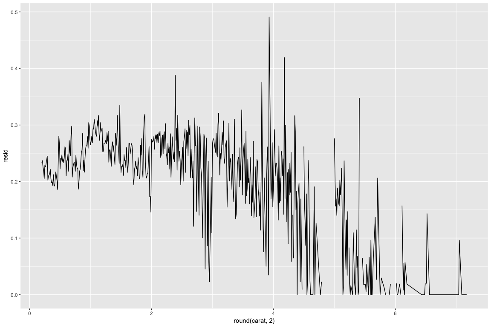

Lesson 9: Diamonds & Price Predictions
================
Josh Goldberg
October 30, 2017

``` r
library(readr)
library(ggplot2)
library(dplyr)
library(tidyr)
library(reshape2)
```

### Welcome

Notes:

------------------------------------------------------------------------

### Scatterplot Review

``` r
# Let's start by examining two variables in the data set.
# The scatterplot is a powerful tool to help you understand
# the relationship between two continuous variables.

# We can quickly see if the relationship is linear or not.
# In this case, we can use a variety of diamond
# characteristics to help us figure out whether
# the price advertised for any given diamond is 
# reasonable or a rip-off.

# Let's consider the price of a diamond and it's carat weight.
# Create a scatterplot of price (y) vs carat weight (x).

# Limit the x-axis and y-axis to omit the top 1% of values.

data(diamonds)
ggplot(aes(x = carat, y = price),
       data = diamonds) +
  coord_cartesian(xlim = c(0, quantile(diamonds$carat, probs = 0.99)),
  ylim = c(0, quantile(diamonds$price, probs = 0.99))) +
  geom_point(fill = I('#F79420'), color = I('black'), shape = 21)
```


``` r
ggplot(aes(x = carat, y = price),
       data = diamonds) +
  coord_cartesian(xlim = c(0, quantile(diamonds$carat, probs = 0.99)),
  ylim = c(0, quantile(diamonds$price, probs = 0.99))) +
  geom_point(color ='#F79420', alpha = 1/4) +
  stat_smooth(method = 'lm')
```


------------------------------------------------------------------------

### Price and Carat Relationship

Response: As carat weight increases, price increases, possibly exponential. Relationship is non-linear. Dispersion increases with higher carat weight. The linear trend line misses the middle of the data. If lm is used, predictions could be off in certain intervals of the dataset.

------------------------------------------------------------------------

### Frances Gerety

Notes:

#### A diamonds is forever.

------------------------------------------------------------------------

### The Rise of Diamonds

Notes: Diamonds rose through a marketing campaign by De Beers cartel. They controlled the global price of diamonds and convinced consumers of the U.S. to purchase diamonds. <https://en.wikipedia.org/wiki/De_Beers#Diamond_monopoly> <https://www.theatlantic.com/magazine/archive/1982/02/have-you-ever-tried-to-sell-a-diamond/304575/>

------------------------------------------------------------------------

### ggpairs Function

Notes:

``` r
# install these if necessary
# install.packages('GGally')
# install.packages('scales')
# install.packages('memisc')
# install.packages('lattice')
# install.packages('MASS')
# install.packages('car')
# install.packages('reshape')
# install.packages('plyr')

# load the ggplot graphics package and the others
library(ggplot2)
library(GGally)
library(scales)
library(memisc)

# sample 10,000 diamonds from the data set
set.seed(20022012)
diamond_samp <- diamonds[sample(1:length(diamonds$price), 10000), ]
ggpairs(diamond_samp,
  lower = list(continuous = wrap("points", shape = I('.'))),
  upper = list(combo = wrap("box", outlier.shape = I('.'))),
  axisLabels = 'internal')
```


What are some things you notice in the ggpairs output? Response: Price is highly correlated with x, y, z, and carat, which are basically the size and dimensions of the diamond. This makes sense. As a diamonds become larger, their price increases.

------------------------------------------------------------------------

### The Demand of Diamonds

Notes: Distribution of monetary variables tend to highly skewed and vary over orders of magnitude due to path dependence or multiplicative processes (such as inflation).

``` r
# Create two histograms of the price variable
# and place them side by side on one output image.

# We’ve put some code below to get you started.

# The first plot should be a histogram of price
# and the second plot should transform
# the price variable using log10.

# Set appropriate bin widths for each plot.
# ggtitle() will add a title to each histogram.

library(gridExtra)

plot1 <- ggplot(aes(x = price), data = diamonds) +
  geom_histogram(aes(fill = I('#099DD9')), binwidth = 100) +
  labs(title = 'Price')

plot2 <- ggplot(aes(x = price), data = diamonds) +
  geom_histogram(aes(fill = I('#F79420')), binwidth = 0.01) +
  scale_x_log10() +
  labs(title = 'Price (log10)')

grid.arrange(plot1, plot2, ncol = 2)
```


------------------------------------------------------------------------

### Connecting Demand and Price Distributions

Notes: The first histogram has a strong positive skewness due to factors outlined above. Transforming the x scale gives a different prospective. The distribution is now bimodal, which could mean there are two central peaks of pricing (moderate pricing, and high pricing).

------------------------------------------------------------------------

### Scatterplot Transformation

``` r
ggplot(aes(x = carat, y = price), data = diamonds) +
  geom_point() +
  scale_y_log10() +
  labs(title = 'Price Log(10) by Carat')
```


### Create a new function to transform the carat variable

``` r
library(scales)
cuberoot_trans = function() trans_new('cuberoot', transform = function(x) x^(1/3),
                                      inverse = function(x) x^3)
```

#### Use the cuberoot\_trans function

``` r
ggplot(aes(carat, price), data = diamonds) + 
  geom_point() + 
  scale_x_continuous(trans = cuberoot_trans(), limits = c(0.2, 3),
                     breaks = c(0.2, 0.5, 1, 2, 3)) + 
  scale_y_continuous(trans = log10_trans(), limits = c(350, 15000),
                     breaks = c(350, 1000, 5000, 10000, 15000)) +
  ggtitle('Price (log10) by Cube-Root of Carat')
```


------------------------------------------------------------------------

### Overplotting Revisited

``` r
head(sort(table(diamonds$carat), decreasing = T))
```

    ## 
    ##  0.3 0.31 1.01  0.7 0.32    1 
    ## 2604 2249 2242 1981 1840 1558

``` r
head(sort(table(diamonds$price), decreasing = T))
```

    ## 
    ## 605 802 625 828 776 698 
    ## 132 127 126 125 124 121

``` r
# Add a layer to adjust the features of the
# scatterplot. Set the transparency to one half,
# the size to three-fourths, and jitter the points.

ggplot(aes(carat, price), data = diamonds) + 
  geom_point(alpha = 1/2, size = 3/4, position = 'jitter') + 
  scale_x_continuous(trans = cuberoot_trans(), limits = c(0.2, 3),
                     breaks = c(0.2, 0.5, 1, 2, 3)) + 
  scale_y_continuous(trans = log10_trans(), limits = c(350, 15000),
                     breaks = c(350, 1000, 5000, 10000, 15000)) +
  ggtitle('Price (log10) by Cube-Root of Carat')
```


------------------------------------------------------------------------

### Other Qualitative Factors

Notes: Clarity seemed to be a factor, but size is more important. According to Blue Nile, cut has a much bigger impact.

------------------------------------------------------------------------

### Price vs. Carat and Clarity

Alter the code below.

``` r
# install and load the RColorBrewer package
library(RColorBrewer)

ggplot(aes(x = carat, y = price, color = clarity), data = diamonds) + 
  geom_point(alpha = 0.5, size = 1, position = 'jitter') +
  scale_color_brewer(type = 'div',
    guide = guide_legend(title = 'Clarity', reverse = T,
    override.aes = list(alpha = 1, size = 2))) +  
  scale_x_continuous(trans = cuberoot_trans(), limits = c(0.2, 3),
    breaks = c(0.2, 0.5, 1, 2, 3)) + 
  scale_y_continuous(trans = log10_trans(), limits = c(350, 15000),
    breaks = c(350, 1000, 5000, 10000, 15000)) +
  ggtitle('Price (log10) by Cube-Root of Carat and Clarity')
```


------------------------------------------------------------------------

### Clarity and Price

Response: Holding points of the plot constant, it looks that diamonds are almost laways more expensive with higher clarity.

------------------------------------------------------------------------

### Price vs. Carat and Cut

Alter the code below.

``` r
library(scales)
ggplot(aes(x = carat, y = price, color = cut), data = diamonds) + 
  geom_point(alpha = 0.5, size = 1, position = 'jitter') +
  scale_color_brewer(type = 'div',
                     guide = guide_legend(title = 'Cut', reverse = T,
                                          override.aes = list(alpha = 1, size = 2))) +  
  scale_x_continuous(trans = cuberoot_trans(), limits = c(0.2, 3),
                     breaks = c(0.2, 0.5, 1, 2, 3)) + 
  scale_y_continuous(trans = log10_trans(), limits = c(350, 15000),
                     breaks = c(350, 1000, 5000, 10000, 15000)) +
  ggtitle('Price (log10) by Cube-Root of Carat and Cut')
```


------------------------------------------------------------------------

### Cut and Price

Response: Not sure, better cut diamonds appear to be more expensive. Though, there is some overlap.

------------------------------------------------------------------------

### Price vs. Carat and Color

Alter the code below.

``` r
ggplot(aes(x = carat, y = price, color = color), data = diamonds) + 
  geom_point(alpha = 0.5, size = 1, position = 'jitter') +
  scale_color_brewer(type = 'div',
                     guide = guide_legend(title = 'Color',
                                          override.aes = list(alpha = 1, size = 2))) +  
  scale_x_continuous(trans = cuberoot_trans(), limits = c(0.2, 3),
                     breaks = c(0.2, 0.5, 1, 2, 3)) + 
  scale_y_continuous(trans = log10_trans(), limits = c(350, 15000),
                     breaks = c(350, 1000, 5000, 10000, 15000)) +
  ggtitle('Price (log10) by Cube-Root of Carat and Color')
```


------------------------------------------------------------------------

### Color and Price

Response: Color influences price as more preferred colors are more expensive at a given point.

------------------------------------------------------------------------

### Linear Models in R

Notes:

Response:

------------------------------------------------------------------------

### Building the Linear Model

Notes:

``` r
m1 <- lm(I(log(price)) ~ I(carat^(1/3)), data = diamonds)
m2 <- update(m1, ~ . + carat)
m3 <- update(m2, ~ . + cut)
m4 <- update(m3, ~ . + color)
m5 <- update(m4, ~ . + clarity)
mtable(m1, m2, m3, m4, m5)
```

    ## 
    ## Calls:
    ## m1: lm(formula = I(log(price)) ~ I(carat^(1/3)), data = diamonds)
    ## m2: lm(formula = I(log(price)) ~ I(carat^(1/3)) + carat, data = diamonds)
    ## m3: lm(formula = I(log(price)) ~ I(carat^(1/3)) + carat + cut, data = diamonds)
    ## m4: lm(formula = I(log(price)) ~ I(carat^(1/3)) + carat + cut + color, 
    ##     data = diamonds)
    ## m5: lm(formula = I(log(price)) ~ I(carat^(1/3)) + carat + cut + color + 
    ##     clarity, data = diamonds)
    ## 
    ## ============================================================================================
    ##                        m1             m2             m3             m4            m5        
    ## --------------------------------------------------------------------------------------------
    ##   (Intercept)          2.821***       1.039***       0.874***      0.932***       0.415***  
    ##                       (0.006)        (0.019)        (0.019)       (0.017)        (0.010)    
    ##   I(carat^(1/3))       5.558***       8.568***       8.703***      8.438***       9.144***  
    ##                       (0.007)        (0.032)        (0.031)       (0.028)        (0.016)    
    ##   carat                              -1.137***      -1.163***     -0.992***      -1.093***  
    ##                                      (0.012)        (0.011)       (0.010)        (0.006)    
    ##   cut: .L                                            0.224***      0.224***       0.120***  
    ##                                                     (0.004)       (0.004)        (0.002)    
    ##   cut: .Q                                           -0.062***     -0.062***      -0.031***  
    ##                                                     (0.004)       (0.003)        (0.002)    
    ##   cut: .C                                            0.051***      0.052***       0.014***  
    ##                                                     (0.003)       (0.003)        (0.002)    
    ##   cut: ^4                                            0.018***      0.018***      -0.002     
    ##                                                     (0.003)       (0.002)        (0.001)    
    ##   color: .L                                                       -0.373***      -0.441***  
    ##                                                                   (0.003)        (0.002)    
    ##   color: .Q                                                       -0.129***      -0.093***  
    ##                                                                   (0.003)        (0.002)    
    ##   color: .C                                                        0.001         -0.013***  
    ##                                                                   (0.003)        (0.002)    
    ##   color: ^4                                                        0.029***       0.012***  
    ##                                                                   (0.003)        (0.002)    
    ##   color: ^5                                                       -0.016***      -0.003*    
    ##                                                                   (0.003)        (0.001)    
    ##   color: ^6                                                       -0.023***       0.001     
    ##                                                                   (0.002)        (0.001)    
    ##   clarity: .L                                                                     0.907***  
    ##                                                                                  (0.003)    
    ##   clarity: .Q                                                                    -0.240***  
    ##                                                                                  (0.003)    
    ##   clarity: .C                                                                     0.131***  
    ##                                                                                  (0.003)    
    ##   clarity: ^4                                                                    -0.063***  
    ##                                                                                  (0.002)    
    ##   clarity: ^5                                                                     0.026***  
    ##                                                                                  (0.002)    
    ##   clarity: ^6                                                                    -0.002     
    ##                                                                                  (0.002)    
    ##   clarity: ^7                                                                     0.032***  
    ##                                                                                  (0.001)    
    ## --------------------------------------------------------------------------------------------
    ##   R-squared            0.924          0.935          0.939         0.951          0.984     
    ##   adj. R-squared       0.924          0.935          0.939         0.951          0.984     
    ##   sigma                0.280          0.259          0.250         0.224          0.129     
    ##   F               652012.063     387489.366     138654.523     87959.467     173791.084     
    ##   p                    0.000          0.000          0.000         0.000          0.000     
    ##   Log-likelihood   -7962.499      -3631.319      -1837.416      4235.240      34091.272     
    ##   Deviance          4242.831       3613.360       3380.837      2699.212        892.214     
    ##   AIC              15930.999       7270.637       3690.832     -8442.481     -68140.544     
    ##   BIC              15957.685       7306.220       3761.997     -8317.942     -67953.736     
    ##   N                53940          53940          53940         53940          53940         
    ## ============================================================================================

Notice how adding cut to our model does not help explain much of the variance in the price of diamonds. This fits with our exploration earlier.

------------------------------------------------------------------------

### Model Problems

Video Notes: I wrapper stands for "as-is." It instructs R to interpret the values by operation before appling lm.

Research: (Take some time to come up with 2-4 problems for the model) (You should 10-20 min on this)

Response: There are a lot of variables included in the model (some with redundancy such as carat and cube-root carat). Overfitting could be an issue. It's possible some of the real-world fundamentals of the diamond market should be considered when employing such a model.

------------------------------------------------------------------------

### A Bigger, Better Data Set

Notes:

``` r
load("BigDiamonds.rda")
```

The code used to obtain the data is available here: <https://github.com/solomonm/diamonds-data>

Building a Model Using the Big Diamonds Data Set
------------------------------------------------

Notes:

``` r
# Your task is to build five linear models like Solomon
# did for the diamonds data set only this
# time you'll use a sample of diamonds from the
# diamondsbig data set.

# Be sure to make use of the same variables
# (logprice, carat, etc.) and model
# names (m1, m2, m3, m4, m5).

# To get the diamondsbig data into RStudio
# on your machine, copy, paste, and run the
# code in the Instructor Notes. There's
# 598,024 diamonds in this data set!

# Since the data set is so large,
# you are going to use a sample of the
# data set to compute the models. You can use
# the entire data set on your machine which
# will produce slightly different coefficients
# and statistics for the models.

# This exercise WILL BE automatically graded.

# You can leave off the code to load in the data.
# We've sampled the data for you.
# You also don't need code to create the table output of the models.
# We'll do that for you and check your model summaries (R^2 values, AIC, etc.)

# Your task is to write the code to create the models.
diamondbig_samp <- diamonds[sample(1:length(diamonds$price), 10000), ]
m1 <- lm(I(log(price)) ~ I(carat^(1/3)), data = diamondsbig[diamonds$price < 10000 &
                                                              diamondsbig$cert == 'GIA',])
m2 <- update(m1, ~ . + carat)
m3 <- update(m2, ~ . + cut)
m4 <- update(m3, ~ . + color)
m5 <- update(m4, ~ . + clarity)
mtable(m1, m2, m3, m4, m5)
```

    ## 
    ## Calls:
    ## m1: lm(formula = I(log(price)) ~ I(carat^(1/3)), data = diamondsbig[diamonds$price < 
    ##     10000 & diamondsbig$cert == "GIA", ])
    ## m2: lm(formula = I(log(price)) ~ I(carat^(1/3)) + carat, data = diamondsbig[diamonds$price < 
    ##     10000 & diamondsbig$cert == "GIA", ])
    ## m3: lm(formula = I(log(price)) ~ I(carat^(1/3)) + carat + cut, data = diamondsbig[diamonds$price < 
    ##     10000 & diamondsbig$cert == "GIA", ])
    ## m4: lm(formula = I(log(price)) ~ I(carat^(1/3)) + carat + cut + color, 
    ##     data = diamondsbig[diamonds$price < 10000 & diamondsbig$cert == 
    ##         "GIA", ])
    ## m5: lm(formula = I(log(price)) ~ I(carat^(1/3)) + carat + cut + color + 
    ##     clarity, data = diamondsbig[diamonds$price < 10000 & diamondsbig$cert == 
    ##     "GIA", ])
    ## 
    ## =================================================================================================
    ##                         m1              m2              m3             m4              m5        
    ## -------------------------------------------------------------------------------------------------
    ##   (Intercept)           2.890***        1.213***        1.013***       0.115***       -0.794***  
    ##                        (0.003)         (0.006)         (0.006)        (0.006)         (0.008)    
    ##   I(carat^(1/3))        5.631***        8.264***        8.289***       8.553***        8.697***  
    ##                        (0.003)         (0.009)         (0.009)        (0.007)         (0.005)    
    ##   carat                                -0.819***       -0.836***      -0.819***       -0.843***  
    ##                                        (0.003)         (0.003)        (0.002)         (0.001)    
    ##   cut: V.Good                                           0.131***       0.088***        0.065***  
    ##                                                        (0.002)        (0.001)         (0.001)    
    ##   cut: Ideal                                            0.249***       0.195***        0.128***  
    ##                                                        (0.002)        (0.001)         (0.001)    
    ##   color: K/L                                                           0.126***        0.123***  
    ##                                                                       (0.004)         (0.003)    
    ##   color: J/L                                                           0.304***        0.321***  
    ##                                                                       (0.003)         (0.002)    
    ##   color: I/L                                                           0.453***        0.478***  
    ##                                                                       (0.003)         (0.002)    
    ##   color: H/L                                                           0.602***        0.627***  
    ##                                                                       (0.003)         (0.002)    
    ##   color: G/L                                                           0.705***        0.716***  
    ##                                                                       (0.003)         (0.002)    
    ##   color: F/L                                                           0.793***        0.800***  
    ##                                                                       (0.003)         (0.002)    
    ##   color: E/L                                                           0.855***        0.850***  
    ##                                                                       (0.003)         (0.002)    
    ##   color: D/L                                                           0.994***        0.963***  
    ##                                                                       (0.003)         (0.002)    
    ##   clarity: I1                                                                          0.303***  
    ##                                                                                       (0.007)    
    ##   clarity: SI2                                                                         0.581***  
    ##                                                                                       (0.007)    
    ##   clarity: SI1                                                                         0.716***  
    ##                                                                                       (0.007)    
    ##   clarity: VS2                                                                         0.841***  
    ##                                                                                       (0.007)    
    ##   clarity: VS1                                                                         0.917***  
    ##                                                                                       (0.007)    
    ##   clarity: VVS2                                                                        0.974***  
    ##                                                                                       (0.007)    
    ##   clarity: VVS1                                                                        1.051***  
    ##                                                                                       (0.007)    
    ##   clarity: IF                                                                          1.174***  
    ##                                                                                       (0.007)    
    ## -------------------------------------------------------------------------------------------------
    ##   R-squared             0.916           0.930           0.934          0.964           0.983     
    ##   adj. R-squared        0.916           0.930           0.934          0.964           0.983     
    ##   sigma                 0.381           0.347           0.337          0.248           0.171     
    ##   F               4538941.981     2788677.666     1480143.907     946212.141     1214335.453     
    ##   p                     0.000           0.000           0.000          0.000           0.000     
    ##   Log-likelihood  -190601.106     -150778.198     -139121.315      -9482.547      145731.357     
    ##   Deviance          60931.140       50379.003       47651.224      25657.417       12226.746     
    ##   AIC              381208.212      301564.397      278254.631      18993.093     -291418.715     
    ##   BIC              381241.047      301608.177      278320.302      19146.326     -291177.921     
    ##   N                418814          418814          418814         418814          418814         
    ## =================================================================================================

------------------------------------------------------------------------

Predictions
-----------

Example Diamond from BlueNile: Round 1.00 Very Good I VS1 $5,601

``` r
#Be sure you’ve loaded the library memisc and have m5 saved as an object in your workspace.
thisDiamond = data.frame(carat = 1.00, cut = "V.Good",
                         color = "I", clarity = "VS1")
modelEstimate = predict(m5, newdata = thisDiamond,
                        interval = "prediction", level = .95)

exp(modelEstimate)
```

    ##        fit      lwr      upr
    ## 1 5014.212 3587.218 7008.863

``` r
summary(subset(diamondsbig, carat == 1.00 & cut == "V.Good" & color == "I" & clarity == "VS1")$price)
```

    ##    Min. 1st Qu.  Median    Mean 3rd Qu.    Max. 
    ##    2396    4684    5287    5098    5560    7350

``` r
dat = data.frame(m4$model, m4$residuals)

with(dat, sd(m4.residuals))
```

    ## [1] 0.2475121

``` r
with(subset(dat, carat > .9 & carat < 1.1), sd(m4.residuals))
```

    ## [1] 0.2779446

``` r
dat$resid <- as.numeric(dat$m4.residuals)
ggplot(aes(y = resid, x = round(carat, 2)), data = dat) +
  geom_line(stat = "summary", fun.y = sd)
```



Evaluate how well the model predicts the BlueNile diamond's price. Think about the fitted point estimate as well as the 95% CI. It's pretty close to the mean and median of the subset of those variables. It seems like a decent prediction. So we're 95% confident that the price will fall between 3587.218 and 7008.863. The lower bound of the confidence interval is in between the minimum and the 1st quartile.
